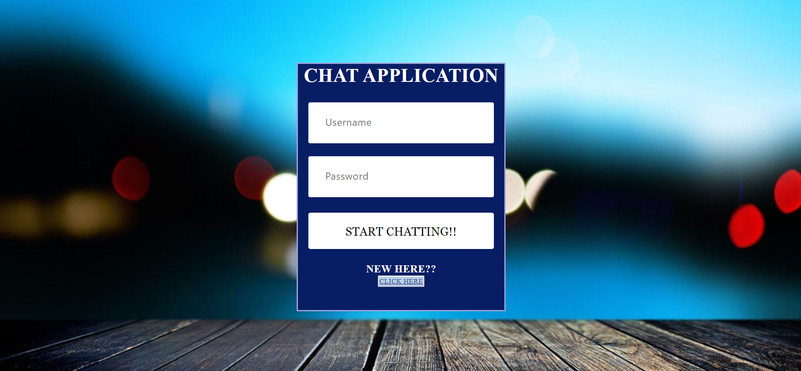
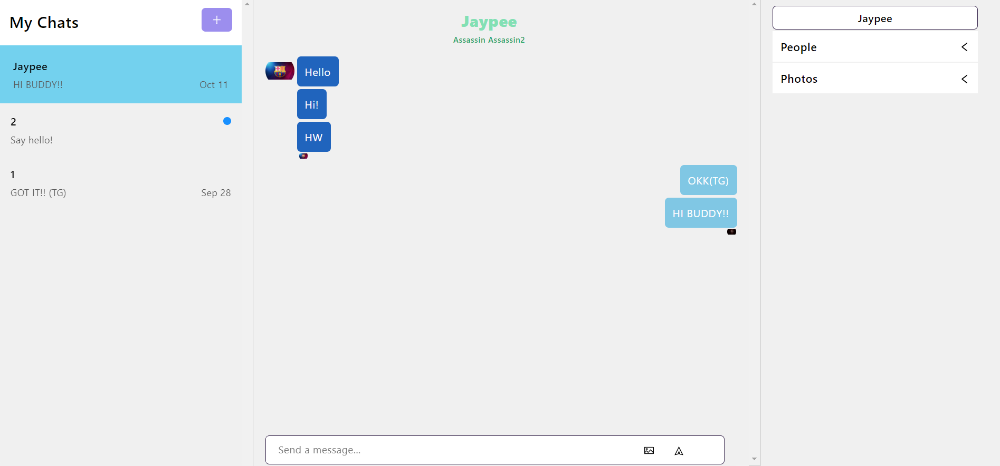

# CHAT APP
An application which let users chat with each other by creating a new chat.
 
Users can also create a group chat and then chat with many people at once.
 
Users only have to login once, after that they can always operate their account.
 
Users can send text messages and images to each other as well.
 
 
Visit the Website : https://chat-app-assassin1771.netlify.app/

 
 

 
 
 

### Installation and Setup Instructions

Clone down this repository. You will need node and npm installed globally on your machine.

Installation:
 
npm install

To Run Test Suite:
 
npm test

To Start Server:
 
npm start

To Visit App:
 
http://localhost:3000
 
 
 
An innovative project which I always wanted to build.
 
The application was created with the help of React Chat Engine, React JS and basic HTML and CSS.
 
I will soon be implementing the backend for the applicaiton with the help of Socket IO and Express.
